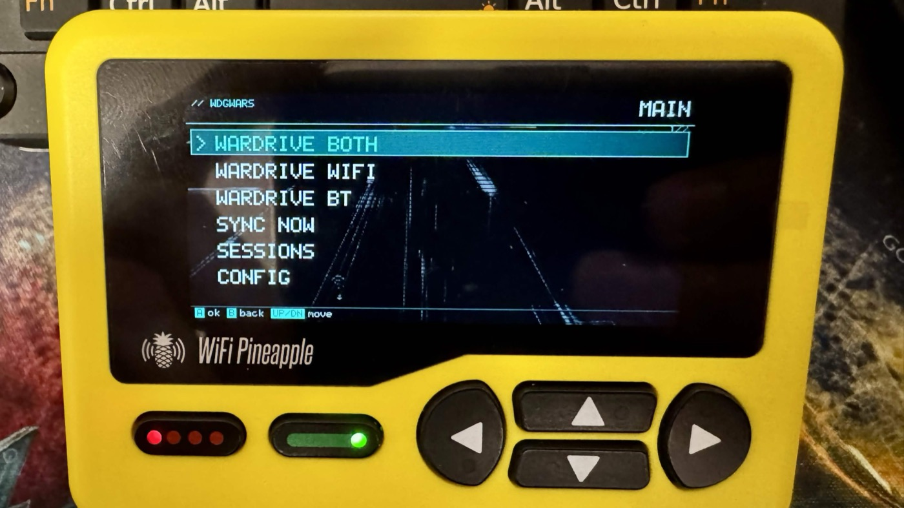
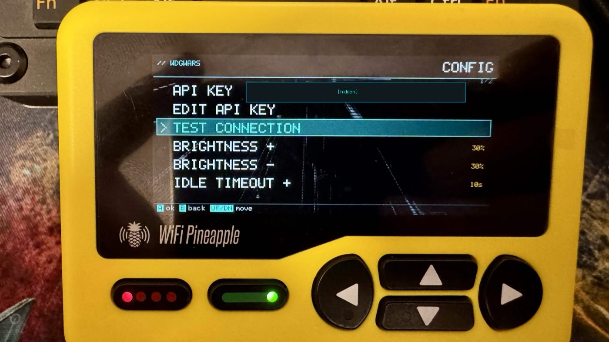
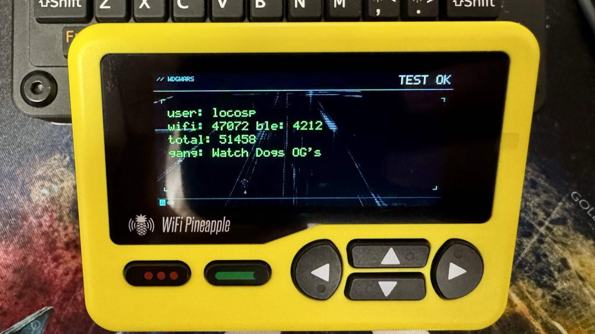

# WDGoWars Wardriver — Hak5 WiFi Pineapple Pager payload

Native payload for the [Hak5 WiFi Pineapple Pager](https://docs.hak5.org/wifi-pineapple-pager/)
that turns it into an offline-first **WiFi + BLE wardriver** feeding the
[wdgwars.pl](https://wdgwars.pl) ARG / wardriving game.

<p align="center">
  
  
</p>
<p align="center">
  
  
</p>

- WiFi capture via `iw dev wlan0 scan`
- BLE LE capture via `bluetoothctl` under a pty (real async `[CHG] RSSI` events)
- GPS from a **u-blox 7** USB stick (NMEA over CDC-ACM) — 3D fix required before scan starts
- Stores everything as standard **WigleWifi-1.6** CSV in `/mmc/root/loot/wdgwars/sessions/`
- Manual **SYNC NOW** uploads pending CSVs to `POST /api/upload-csv` (x30/min rate)
- "NEW BADGE" flash after sync, including the 🍍 `hak5_pager_user` *Hak5 Pager Op*
- On-pager UI in cyan cyberpunk style — no laptop, no web dashboard
- **App handoff** to Loki / PagerGotchi / WiFMan / Bjorn without round-tripping through
  the system pager service (uses the `exit 42 + data/.next_payload` protocol)
- **Idle screen dim** at 20 s (configurable) to keep the device from cooking itself

```
wdgwars/
├── payload.sh          # pager manifest + launcher (RINGTONE/LOG/WAIT_FOR_INPUT)
├── bootstrap.sh        # one-time: fetches pagerctl from wifman, opkg deps
├── config.json         # api_key, gps devices, scan intervals, idle settings
├── handoff.py          # APP_HANDOFF launcher discovery / exit(42) trigger
├── wdgwars.py          # entry point + menu loop (App class)
├── launch_*.sh         # jump-to launchers for the 4 peer payloads
├── lib/                # pagerctl.py + libpagerctl.so (fetched by bootstrap)
├── ui/                 # theme, splash, menu, status HUD, dialog, hex keyboard, idle
├── scanners/           # wifi (iw), ble (bluetoothctl over pty), gps (NMEA)
├── storage/            # WigleWifi-1.6 CSV writer + TTL deduper
└── uploader/           # urllib multipart POST + retry
```

## Install on the pager

1. Copy the `wdgwars/` folder into the standard payloads tree on the pager:

   ```sh
   scp -r wdgwars root@172.16.52.1:/mmc/root/payloads/user/reconnaissance/wdgwars
   ```

2. Run the bootstrap **once** from the pager:

   ```sh
   ssh root@172.16.52.1
   cd /mmc/root/payloads/user/reconnaissance/wdgwars
   sh bootstrap.sh
   ```

   That copies `pagerctl.py` + `libpagerctl.so` from the bundled `wifman`
   payload (no internet needed) and installs `iw`, `bluez-utils`,
   `kmod-usb-acm` via `opkg` if they're missing.

3. Push handoff launchers to peer payloads so `JUMP TO` is bidirectional:

   ```sh
   for d in loki pagergotchi wifman pager_bjorn; do
     scp launchers/launch_wdgwars.sh \
         root@172.16.52.1:/mmc/root/payloads/user/reconnaissance/$d/
   done
   ```

4. Grab an API key at <https://wdgwars.pl/profile> → "Generate API key", then
   either edit `config.json` on the pager (`api_key` field) or use
   **CONFIG → EDIT API KEY** on the device (hex on-screen keyboard).

5. Plug in the u-blox 7 GPS stick. The pager auto-detects
   `/dev/ttyACM2`, `/dev/ttyACM1`, `/dev/ttyACM0`, `/dev/ttyUSB0` and locks
   onto the first one emitting valid NMEA.

6. From the pager dashboard pick **Payloads → User → Reconnaissance → WDGoWars Wardriver**.

## UI map

```
SPLASH + GREEN-gate
  │
  ▼
MAIN MENU
  ├── WARDRIVE BOTH     // WiFi + BLE concurrently (separate radios)
  ├── WARDRIVE WIFI     // iw scan only
  ├── WARDRIVE BT       // BLE only
  │    │
  │    ▼ (any scan waits here if no GPS fix)
  │   GPS WAIT   dev:/dev/ttyACM2  sats:N  B=cancel
  │    │
  │    ▼
  │   LIVE HUD 2×2   WiFi / BLE counters, GPS state, queue rows
  │                  A=pause  B=end  ↑↓=brightness
  │
  ├── SYNC NOW       // multipart upload, NEW BADGE flash
  ├── SESSIONS       // list files with v / ^ / x icons
  ├── CONFIG
  │    ├── API KEY          // masked view
  │    ├── EDIT API KEY     // hex on-screen keyboard
  │    ├── TEST CONNECTION  // GET /api/me, shows user/wifi/ble/gang
  │    ├── BRIGHTNESS +/-   // 70% default, stays on position
  │    ├── IDLE TIMEOUT +/- // 20 s default, 5-600 s
  │    ├── DIM LEVEL +/-    // 10% default (hardware off-floor)
  │    └── BACK
  ├── JUMP TO ...    // 4 peers — Loki / PagerGotchi / WiFMan / Bjorn
  └── POWER OFF
```

**Buttons:** UP/DOWN = navigate, A = select, B = back. In the HUD: ↑↓ adjust
brightness live, A pauses scanning, B ends and saves the session.

## Idle screen dim

After 20 s without input the backlight drops to **10%** (matches the
pagergotchi convention — below that the LCD doesn't actually go any darker
on this hardware). Any button press restores the user brightness.

Configure via `CONFIG → IDLE TIMEOUT +/-` and `DIM LEVEL +/-`, or edit
`config.json`:

```json
"ui": {
  "brightness": 70,
  "idle_timeout_s": 20,
  "auto_dim_level": 10
}
```

Set `idle_timeout_s` to a very large number to effectively disable auto-dim.

## App handoff — JUMP TO …

The main menu shows a **JUMP TO …** entry that lets you hop straight into
another pager payload without returning to the Hak5 dashboard first. Hak5's
system pager UI takes ~30 s to restart; this skips it entirely, so you can
swap between scanner, companion, wardriver and helper apps in a second.

JUMP TO only appears if at least one peer is installed. Each supported app
gets its own row:

| Payload | What it does | Repo |
|---|---|---|
| **Loki** | Autonomous network reconnaissance — ARP/ICMP host discovery, nmap port + NSE vuln scans, SSH/FTP/Telnet/SMB/MySQL/RDP brute force, file exfiltration | [pineapple-pager-projects/pineapple_pager_loki](https://github.com/pineapple-pager-projects/pineapple_pager_loki) |
| **PagerGotchi** | Pwnagotchi port — automated WiFi handshake capture with the classic pwnagotchi "face" + mood animations | [pineapple-pager-projects/pineapple_pager_pagergotchi](https://github.com/pineapple-pager-projects/pineapple_pager_pagergotchi) |
| **Bjorn** | Offensive recon companion with a Viking aesthetic — hosts/attacks/credentials stats, targets list, loot browser | [pineapple-pager-projects/pineapple_pager_bjorn](https://github.com/pineapple-pager-projects/pineapple_pager_bjorn) |
| **WiFMan** | WiFi profile manager — saved SSID list, one-click reconnect, on-device credential keyboard | [LOCOSP/pineapple_pager_wifman](https://github.com/LOCOSP/pineapple_pager_wifman) |

To make the other direction work (so Loki/PagerGotchi/Bjorn/WiFMan can jump
*back* to WDGoWars), push `launchers/launch_wdgwars.sh` into each peer's
directory — the install instructions above include a loop that does this.

Under the hood WDGoWars implements the `exit 42 + data/.next_payload`
protocol ([APP_HANDOFF spec](https://github.com/pineapple-pager-projects/pineapple_pager_loki/blob/main/APP_HANDOFF.md))
that brAinphreAk's projects established. Any other pager app that follows
the same convention will slot in automatically — just drop a matching
`launch_<name>.sh` into `wdgwars/`.

## Output format

Sessions are written as standard [WiGLE WiFi 1.6](https://wigle.net/uploads.html)
CSV files (`wd-<UTC>-<index>.csv`). Successful uploads get a `<name>.csv.uploaded`
sibling marker, failed ones `<name>.csv.error` — the **SESSIONS** screen colour-codes
accordingly. Uploading a pager-generated file earns the 🍍 **Hak5 Pager Op**
badge on wdgwars.pl automatically.

## Security

- The real API key lives **only on the pager** in `config.json` and in your
  local `.key` file (both gitignored).
- `bootstrap.sh` never writes an api key. You must either paste one into
  `config.json` on the pager via SSH or type it via **CONFIG → EDIT API KEY**.
- The payload only collects **publicly broadcast** data — the same information
  every WiFi / BLE device puts out over the air. No packet interception, no
  traffic analysis.

## Local development

Parsers (WiFi, BLE, NMEA) + CSV writer + deduper are decoupled from the pager:

```sh
python3 -m unittest discover -t . -s tests
```

21 tests covering the stuff that can be exercised without the LCD.

## Non-goals

- No web dashboard — everything on the pager LCD.
- No Aircraft (ADS-B) or LoRa mesh — pager has no SDR / LoRa.
- No multi-theme switching — one coherent cyberpunk look.
- No packet capture / handshake grabbing — we only log broadcasts.

## Credits

- pagerctl bindings + payload pattern: [LOCOSP/pineapple_pager_wifman](https://github.com/LOCOSP/pineapple_pager_wifman)
- APP_HANDOFF protocol + auto-dim convention: [pineapple-pager-projects/pineapple_pager_loki](https://github.com/pineapple-pager-projects/pineapple_pager_loki), [pineapple_pager_pagergotchi](https://github.com/pineapple-pager-projects/pineapple_pager_pagergotchi), [pineapple_pager_bjorn](https://github.com/pineapple-pager-projects/pineapple_pager_bjorn) by brAinphreAk
- Portal + API: [wdgwars.pl](https://wdgwars.pl) by LOCOSP
- WigleWifi-1.6 format: [WiGLE](https://wigle.net)
